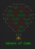
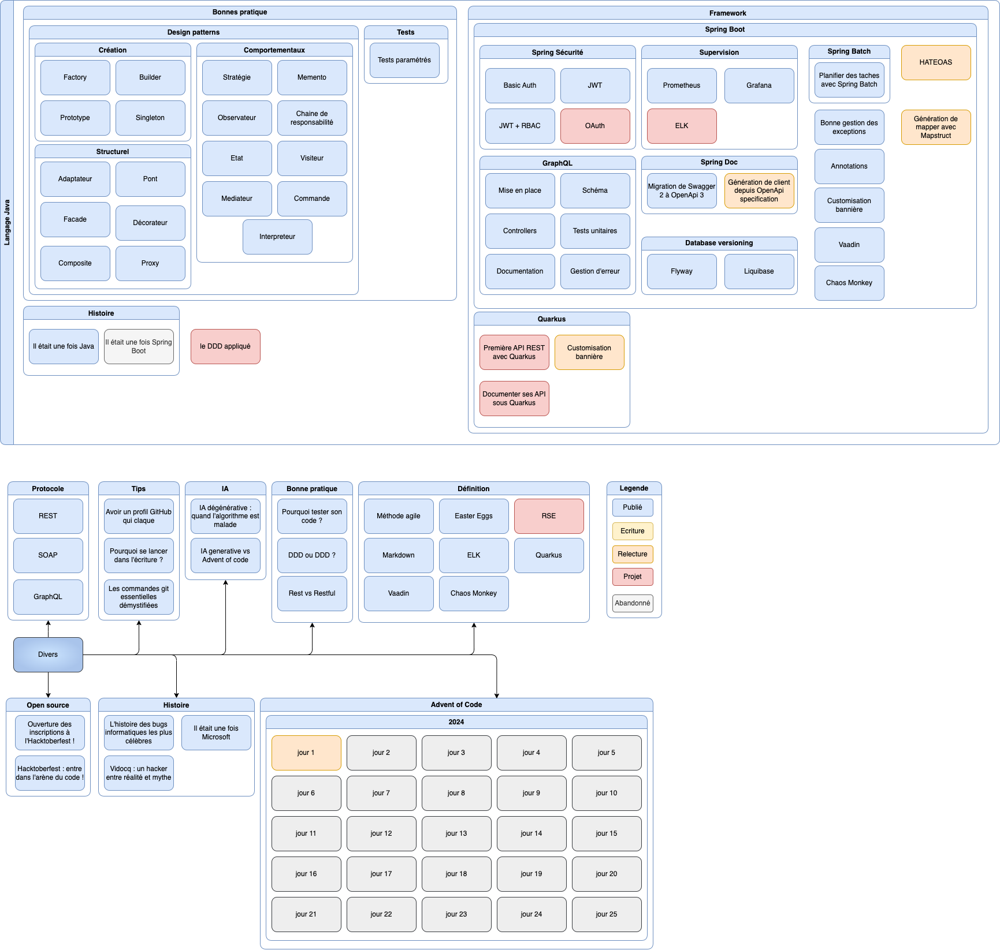

# LE TUTOUR Erwan

## About me

  

## 👦🏼 Social

## Skills
### 💻 OS

### 👨🏼‍💻 Code

### 🛠 Tools

### 🗣 Languages

### 🖍 Design

## Github Stats

 

## Events
|      |                                                Hacktoberfest 	                                                |                                        Advent of Code	                                        | meetup                                    |
|------|:-------------------------------------------------------------------------------------------------------------:|:---------------------------------------------------------------------------------------------:|-------------------------------------------|
| 2020 |  	 |   	  |                                           |
| 2021 |    |  |                                           |
| 2022 |    |  |                                           |
| 2023 |  |                                                                                               |  |
| 2024 |  |  |  |

# 📝 Blog posts
## Find me

## [SFEIR.dev](https://www.sfeir.dev/)
### [Design Patterns](https://github.com/ErwanLT/designPattern)
| Creation | Comportementaux | Structurels |
|--- | --- | --- |
| [Factory](https://www.sfeir.dev/back/design-pattern-factory/) | [Stratégie](https://www.sfeir.dev/back/les-designs-pattern-comportementaux/) | [Adaptateur](https://www.sfeir.dev/back/les-design-patterns-structurel-adaptateur/) |
| [Builder](https://www.sfeir.dev/back/les-designs-patterns-de-creation-builder/) | [Mémento](https://www.sfeir.dev/back/design-patterns-comportementaux-memento/) | [Composite](https://www.sfeir.dev/back/les-design-patterns-structurels-composite/) |
| [Prototype](https://www.sfeir.dev/back/les-designs-patterns-de-creation-prototype/) | [Médiateur](https://www.sfeir.dev/back/design-patterns-comportementaux-mediateur/) | [Décorateur](https://www.sfeir.dev/back/les-design-patterns-structurels-decorateur/) |
| [Singleton](https://www.sfeir.dev/back/design-pattern-singleton/) | [Observateur](https://www.sfeir.dev/back/design-patterns-comportementaux-observateur/) | [Facade](https://www.sfeir.dev/back/les-design-patterns-structurels-facade/) |
| | [Chaine de responsabilité](https://www.sfeir.dev/back/design-patterns-comportementaux-chaine-responsabilite/) | [Pont](https://www.sfeir.dev/back/les-design-patterns-structurels-pont/)|
| | [Commande](https://www.sfeir.dev/back/design-patterns-comportementaux-commande/) | [Proxy](https://www.sfeir.dev/back/les-design-patterns-structurels-proxy/) |
| | [Etat](https://www.sfeir.dev/back/design-patterns-comportementaux-etat/) | |
| | [Visiteur](https://www.sfeir.dev/back/les-design-patterns-comportementaux-visiteur/) | |
| | [Interpréteur](https://www.sfeir.dev/back/les-design-patterns-comportementaux-interpreteur/) | |

### 💡 Tips
* [Test paramétrés - un test pour les gouverner tous](https://www.sfeir.dev/back/un-test-pour-les-gouverner-tous/)
* [Réussir sa migration de Swagger 2 à OpenApi 3](https://www.sfeir.dev/back/migrer-de-swagger-2-a-openapi-3/)
* [Comment bien gérer ses exceptions dans Spring Boot](https://www.sfeir.dev/back/comment-bien-gerer-ses-erreur-dans-springboot/)
* [Avoir un profil GitHub qui claque](https://www.sfeir.dev/product/avoir-un-profil-github-qui-claque/)
* [Les commandes git essentielles démystifiées](https://www.sfeir.dev/product/draft-les-commande-git/)
* [Comprendre les annotations dans Spring Boot](https://www.sfeir.dev/back/comprendre-les-annotations-dans-spring-boot/)

### [Spring Boot](https://github.com/ErwanLT/springboot-demo)
* [Comment personnaliser la bannière d'un projet Spring Boot](https://www.sfeir.dev/back/comment-avoir-une-banniere-spring-personnalisee/)
* [Comment bien gérer ses exceptions dans Spring Boot](https://www.sfeir.dev/back/comment-bien-gerer-ses-erreur-dans-springboot/)
* [Superviser votre application Spring Boot grâce à Prometheus et Grafana](https://www.sfeir.dev/back/superviser-votre-application-spring-boot/)
* [Planifier des tâches avec Spring Batch](https://www.sfeir.dev/back/planifier-des-taches-avec-spring-batch/)
* [Mettre en place une API GraphQL avec Spring Boot](https://www.sfeir.dev/back/spring-boot-graphql/)
* [Créer un pokedex avec Spring Boot et Vaadin](https://www.sfeir.dev/back/papa-je-veux-un-pokedex-partie-1/)
* Spring sécurity
  * [Spring sécurity : mettre en place basic Auth](https://www.sfeir.dev/back/securisez-vos-api-avec-spring-security-basic-auth/)
  * [Spring sécurity : mettre en place JWT](https://www.sfeir.dev/back/securisez-vos-api-avec-spring-security-jwt/)
  * [Spring sécurity : mettre en place JWT + RBAC](https://www.sfeir.dev/back/securisez-vos-api-avec-spring-security-acces-par-role/)
* [Migration de base de données : Flyway vs Liquibase](https://www.sfeir.dev/back/migration-versioning-de-base-de-donnees-dans-une-application-spring-boot/)
* [Introduisez du chaos dans votre application Spring Boot](https://www.sfeir.dev/back/introduisez-du-chaos-dans-votre-application-spring-boot/)

## Carte mentale des articles

